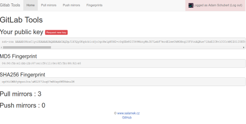

# GitLab Tools

This application provides functionality not avaiable in GitLab (CE)
Mainly useful for pull mirroring from GitHub

[](doc/img/home.png)
* [Fingerprints screenshoot](doc/img/fingerprints.png)
* [Pull mirrors screenshoot](doc/img/pull_mirrors.png)


# Avaiable features

|  Feature name |  Gitlab CE  |  Gitlab EE  |  Gitlab Tools  | Description | 
|:--------------|:-----------:|:-----------:|:--------------:|:-----------:|
|  Pull mirror [(doc)](https://github.com/Salamek/gitlab-tools/wiki/1.-Pull-mirror-configuration-guide)  |      No     |     Yes     |       Yes      | Allows to automaticaly mirror your Git or SVN repositories to GitLab by hook trigger or periodicaly |
|  Push mirror [(doc)](https://github.com/Salamek/gitlab-tools/wiki/2.-Push-mirror-configuration-guide)  |  Yes(10.8)  |     Yes     |       Yes      | Allows to automaticaly mirror your GitLab repository to any remote Git repository |
|  Deploy       |   Yes(CI)   |   Yes(CI)   |       WIP      | Allows deploy to non GIT network storages (FTP, SCP) using native protocols (no fuse). Cannibalizes https://github.com/Salamek/git-deploy |

# Installation

## Debian and derivates (Debian 9 and Ubuntu 18.04 LTS are supported, other versions may also work...)

Add repository by running these commands

```bash
$ wget -O - https://apt.salamek.cz/apt/conf/salamek.gpg.key|sudo apt-key add -
$ echo "deb     https://apt.salamek.cz/apt all main" | sudo tee /etc/apt/sources.list.d/salamek.cz.list
```

And then you can install a package python3-gitlab-tools

```bash
$ apt update && apt install python3-gitlab-tools
```

## Archlinux

Add repository by adding this at end of file /etc/pacman.conf

```
[salamek]
Server = https://arch.salamek.cz/any
SigLevel = Optional
```

and then install by running

```bash
$ pacman -Sy gitlab-tools
```

# Setup

After successful installation you will need to run setup to configure your installation:

```bash
$ gitlab-tools setup
```

This will start simple setup utility where you can/must configure

1. gitlab-tools user (default: gitlab-tools, should be created after install)
2. Database type to use, PostgreSQL is recommended database to use (you can use other database types only on your own risk)
    1. Database host (PostgreSQL, MySQL) or path (Only SQLite)
    2. Database name (PostgreSQL, MySQL)
    3. Database user (PostgreSQL, MySQL)
    4. Database password (PostgreSQL, MySQL)
3. Webserver configuration (Host and port makes sense only when using integrated web server controlled by gitlab-tools service)
4. Server name (eg.: https://gitlab-tools.example.com or IP:PORT when using integrated webserver)
5. GitLab API configuration (you can follow this guide till point 7. https://docs.gitlab.com/ee/integration/gitlab.html) redirect url is https://gitlab-tools.example.com/sign/in/do where example.com is your server domain
    1. Gitlab APP ID: Application Id
    2. Gitlab APP SECRET: Secret
6. Save new configuration ? -> y (this will create config file in /etc/gitlab-tools/config.yml)
7. Recreate database ? -> y (this will create new empty database)
8. Restart services to load new configuration ? -> y this will restart all gitlab-tools services:
    1. gitlab-tools: Controlling integrated webserver, disable this one if you want to use uwsgi or so.
    2. gitlab-tools_celeryworker: Controlling backround workers, must be enabled and running to perform mirroring
    3. gitlab-tools_celerybeat: Controlling celery scheduler

This creates/updates config file in /etc/gitlab-tools/config.yml, you can modify this file manualy

After this you should have gitlab-tools running on your "server name"

# Running behind UWSGI

Install uwsgi

```
$ apt install uwsgi uwsgi-plugin-python3
```

Create uwsgi application configuration file at `/etc/uwsgi/apps-available/gitlab-tools.example.com.ini`:
```ini
[uwsgi]
uid = gitlab-tools
master = true
chdir = /usr/lib/python3/dist-packages/gitlab_tools
socket = /tmp/gitlab-tools.sock
module = wsgi
callable = app
plugins = python3
buffer-size = 32768
```

Link this config file to `/etc/uwsgi/apps-enabled` by running
```bash
$ ln -s /etc/uwsgi/apps-available/gitlab-tools.example.com.ini /etc/uwsgi/apps-enabled/
```

Restart uwsgi to load new configuration
```bash
$ systemctl restart uwsgi
```

Now you should have `/tmp/gitlab-tools.sock` socket file created, check that by running
```bash
$ file /tmp/gitlab-tools.sock
```

# Webserver NGINX

Install nginx by running
```
apt install nginx
```

Create configuration file at `/etc/nginx/sites-available/gitlab-tools.example.com`:

```
# Uncomment this when using SSL
#server {
#    listen       80;
#    listen       [::]:80;
#    server_name  gitlab-tools.example.com;
#    return       301 https://gitlab-tools.example.com$request_uri;
#}

server {
        # Uncomment these to use SSL
        #listen 443 ssl http2;
        #listen [::]:443 ssl http2;
        # Comment these to use SSL
        listen 80;
        listen [::]:80;
        server_name gitlab-tools.example.com;

        root /usr/lib/python3/dist-packages/gitlab_tools;

        # Uncomment these to use SSL
        #ssl on;
        #ssl_certificate letsencrypt/certs/example.com/fullchain.pem;
        #ssl_certificate_key letsencrypt/certs/example.com/privkey.pem;

        location '/.well-known/acme-challenge' {
                default_type "text/plain";
                root        /var/tmp/letsencrypt-auto;
        }

        location / {
                uwsgi_pass unix:///tmp/gitlab-tools.sock;
                include uwsgi_params;
        }
}

```

Link this file to `/etc/nginx/sites-enabled` by running
```bash
$ ln -s /etc/nginx/sites-available/gitlab-tools.example.com /etc/nginx/sites-enabled/
```

And restart nginx
```bash
$ systemctl restart nginx
```

Now you should have gitlab-tools accessible at `server_name`

# Mirrors
This project is also mirrored on GitLab https://gitlab.com/Salamek/gitlab-tools
